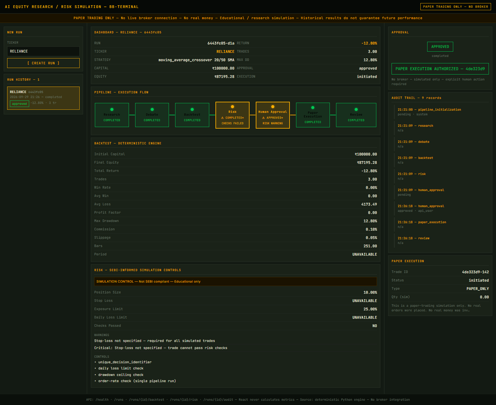
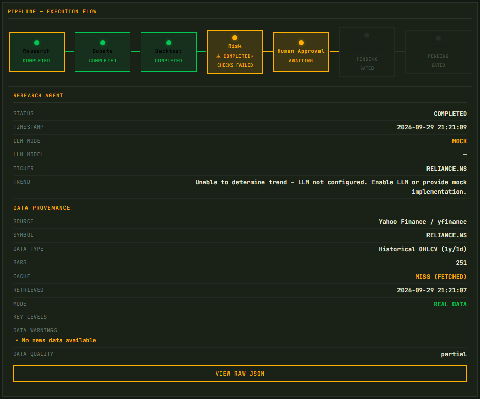
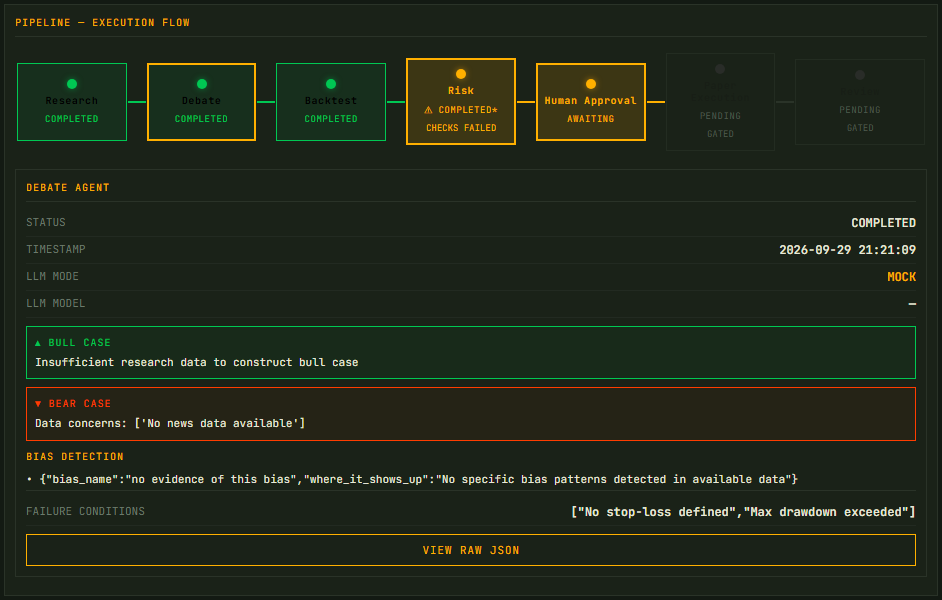
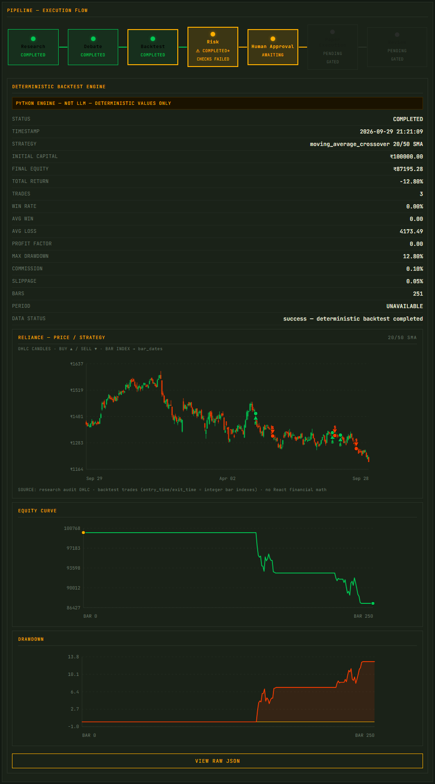
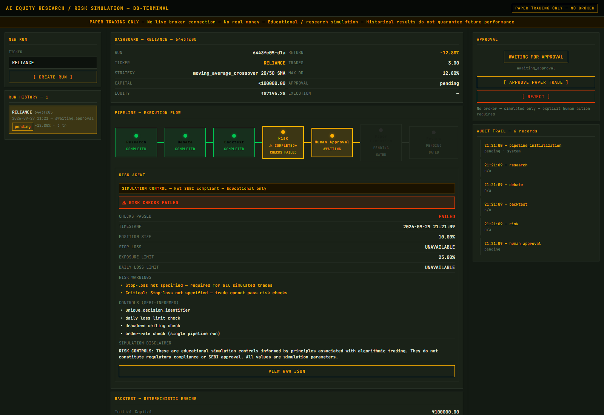
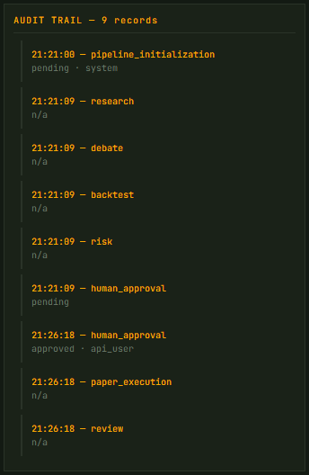

# AI-Orchestrated Equity Research & Market Risk Simulation

**NSE / BSE · NVIDIA NIM · Paper trading only**

[](LICENSE)
[](https://github.com/ArjunPakhan/equity-research-sim/actions/workflows/ci.yml)

A five-stage agent pipeline for Indian equity research and paper-trading simulation. It combines real NSE market data, LLM reasoning, a deterministic quantitative backtesting engine, simulation risk controls, a human approval gate, and a full audit trail — end to end, without ever touching a broker.

> **Paper trading only. No broker API. No real orders. No real money. No investment advice.**

---

## Overview

The pipeline walks the same shape as a real research-to-trade workflow, but stays safe, deterministic where it matters, and auditable:

1. **Research** — an LLM synthesizes market data into a trend thesis and flags data-quality issues.
2. **Debate** — an LLM argues bull and bear cases and records potential biases.
3. **Backtest** — a deterministic Python engine simulates the strategy and computes every financial metric.
4. **Risk** — simulation controls surface position-sizing and stop-loss warnings.
5. **Human approval** — the pipeline halts and waits for an explicit human decision.
6. **Paper execution** — a local, simulated fill (no broker, no real order).
7. **Review** — a skeptical agent assesses whether the trade should have happened at all.

A **FastAPI + React/Vite dashboard** visualizes backend results without recomputing anything, and a **SQLite audit log** records every stage under one `run_id`.

## Architecture

```
                REAL MARKET DATA  (yfinance · NSE .NS · parquet cache)
                                   ↓
                          RESEARCH AGENT  (LLM synthesis)
                                   ↓
                          DEBATE AGENT  (bull/bear + biases)
                                   ↓
                    DETERMINISTIC BACKTEST ENGINE  (Python)
                    20/50 SMA crossover · next-bar open
                    0.1% commission / 0.05% slippage per side
                                   ↓
                           RISK AGENT  (simulation controls)
                                   ↓
                        ┌─ HUMAN APPROVAL GATE ─┐
                        │  APPROVE → paper exec │
                        │  REJECT  → stop       │
                        └───────────────────────┘
                                   ↓
                     PAPER EXECUTION  (PAPER_ONLY, local)
                                   ↓
                         REVIEW AGENT  (skeptical)
```

Full diagram: [docs/assets/architecture.svg](docs/assets/architecture.svg)

## Design philosophy & trust boundaries

**LLMs reason. Code calculates. Controls constrain. Humans authorize.**

| Concern | Owner | Why |
|---|---|---|
| Research, debate, review reasoning | LLM (NVIDIA NIM) | Open-ended language work |
| Every financial number | Deterministic Python engine | Same inputs → same outputs |
| Position sizing, limits, warnings | Risk agent | Simulation guardrails |
| The final decision | Human | Explicit approve/reject, no default |
| The record of what happened | SQLite audit trail | Every stage logged under one `run_id` |

The LLM never computes a metric. The engine in `backtest_engine/` is the single source of truth for P&L, win rate, profit factor, drawdown, fees and slippage. The frontend renders backend JSON only — no JavaScript recomputes financial values.

## Application screenshots

> These are captures of a real documentation run (RELIANCE, engine 1.1.0). LLM stages ran in **mock mode** (no `NVIDIA_API_KEY`), which the UI surfaces explicitly.













## AI Research & Debate

- **Research Agent** consumes OHLCV, fundamentals and news, and produces a trend thesis, key levels and data-quality warnings.
- **Debate Agent** produces a bull case and a bear case, a bias checklist, and explicit no-trade/failure conditions.
- Both record their **provenance**: `llm_mode` (`real` or `mock`) and the model used. Without `NVIDIA_API_KEY` they run in honest mock mode and say so — they never fabricate an LLM answer.

## Deterministic Backtesting

- **Strategy:** 20/50 SMA crossover — **default long-only** (the engine also accepts `short_only` as a direction).
- **Signal** is generated at bar close using data up to and including that bar.
- **Execution** happens at the next bar's open, preventing look-ahead bias.
- **Costs:** 0.1% commission per side (0.2% round-trip total; simulation assumption) and 0.05% slippage per side (simulation assumption).
- **Metrics (all engine-computed):** trades, win rate, avg win/loss, profit factor, max drawdown, final equity, total return, equity curve, drawdown series, and per-trade gross/net P&L, fees and slippage.

## Risk & Human Approval

The Risk Agent is a set of **simulation controls** (position sizing, exposure limit, daily-loss and drawdown ceilings, order-rate checks). It surfaces warnings rather than silently blocking:

- Risk controls **warn**; they do not claim regulatory compliance. The pipeline is **not SEBI compliant**.
- After Risk, the pipeline stops at the **human approval gate** and waits for an explicit `approve` or `reject`.
- A human can approve even when risk checks did not pass — the system records that risk warnings were shown and that a human authorized the next stage. This is by design, and it is **not** a claim that the risk checks passed.

## Auditability

One `run_id` links the stages through the audit log. The `audit_log` table records, per stage: `run_id`, agent name, timestamp, full input/output JSON, and approval metadata (`human_approval_status`, `approved_by`, `approved_at`). Every agent call is inspectable via `GET /runs/{id}/audit`.

## Technology Stack

| Layer | Technology |
|---|---|
| Backend | Python 3.10+, FastAPI, Uvicorn |
| Data | yfinance, pandas, NumPy, pyarrow (parquet cache) |
| LLM (optional) | NVIDIA NIM (OpenAI-compatible endpoint) |
| Frontend | React 18, Vite, no financial math in JS |
| Storage | SQLite (audit trail) |
| Testing | pytest (backend), Node's built-in test runner (frontend) |

## Testing & CI

- **Backend:** `python -m pytest tests/` — **146 tests pass**.
- **Frontend:** `node --test src/components/pipelineState.test.js src/api.test.js` — **17 tests pass**.
- **Build:** `npm run build` (Vite production build).
- **CI:** GitHub Actions runs both jobs on every push and pull request (see [`.github/workflows/ci.yml`](.github/workflows/ci.yml)). The run for the current head is green.

## Project Structure

```
api/                 FastAPI application (runs, approval, audit endpoints)
agents/              Research, Debate, Backtest, Risk, Review agents + NVIDIA NIM config
backtest_engine/     Deterministic strategy + engine (the source of truth for metrics)
orchestrator/        CLI pipeline orchestration
paper_execution/     Local paper-only execution stub
audit/               Audit-log helpers
db/                  SQLite schema
data/                Market-data fetching + parquet cache
frontend/            React/Vite dashboard
tests/               Backend test suite
docs/                Architecture diagram + sample run + screenshots
```

## Quick Start

**Python 3.10+** (CI pins 3.11) and **Node.js 20+** are required.

### 1. Backend

```bash
# macOS / Linux
python3 -m venv .venv
source .venv/bin/activate
pip install -r requirements.txt
uvicorn api.main:app --reload --port 8000
```

```powershell
# Windows (PowerShell)
python -m venv .venv
.\.venv\Scripts\Activate.ps1
pip install -r requirements.txt
uvicorn api.main:app --reload --port 8000
```

Health check: http://localhost:8000/health — API docs: http://localhost:8000/docs

### 2. Frontend (separate terminal)

```bash
cd frontend
npm install
npm run dev
```

The dev server proxies `/health` and `/runs` to the backend. Open http://localhost:5173 (the port in `vite.config.js`).

### 3. Run the tests

```bash
# backend (from the repository root)
python -m pytest tests/ -q

# frontend (from the repository root)
node --test frontend/src/components/pipelineState.test.js frontend/src/api.test.js

# production frontend build (from frontend/)
npm run build
```

## Configuration

All configuration is via process environment variables.

| Variable | Purpose | Required |
|---|---|---|
| `NVIDIA_API_KEY` | Enable real LLM calls (NVIDIA NIM) | No — without it, agents run in mock mode |
| `NVIDIA_MODEL` | Model override | No — defaults to `nvidia/nemotron-3.5-lightning-30b-a3b` |
| `NVIDIA_BASE_URL` | Endpoint override | No — defaults to `https://integrate.api.nvidia.com/v1` |
| `AUDIT_DB_PATH` | Override the SQLite audit DB location | No — defaults to `audit.db` in the repo root |

Notes:

- The NVIDIA key is read from the environment only and is **never logged, stored in SQLite, returned by the API, or sent to the frontend**. Keep it out of git (`.gitignore` already excludes `.env`, `*.key`, and `secrets.toml`).
- `AUDIT_DB_PATH` lets you point a run at a throwaway database — useful for demos and screenshots without polluting your development history.
- See `.env.example` for the full set of variable names.

## Limitations

- One strategy only: 20/50 SMA crossover, default long-only (demo, not optimal).
- Limited demo window (251 daily bars / ~1 year).
- Simulated costs (0.1% commission and 0.05% slippage per side) are assumptions, not broker-specific.
- **Paper execution is a stub.** The current engine records an `initiated` `PAPER_ONLY` execution but does not yet compute a realistic fill — the documentation run produced `simulated_quantity: 0`, `entry_price: 0.0`, `notional: 0.0`, and `entry_price_source: "unavailable — Phase 2 mock"`. It is not a real or meaningful simulated fill.
- Survivorship bias is not corrected; data quality depends on yfinance (delayed, possibly incomplete).
- LLM reasoning is non-deterministic and may hallucinate; quantitative metrics are deterministic and audited, so the numbers stay trustworthy even when the language is not.
- Risk controls are educational simulation, **not SEBI compliance**.
- Historical simulation does not predict future returns. No result here is investment advice.

## Sample Run

A complete, machine-readable sample is in [docs/sample_run.json](docs/sample_run.json) — a documentation run of `RELIANCE` on engine **1.1.0**. Summary:

| Field | Value |
|---|---|
| engine_version | 1.1.0 |
| strategy | moving_average_crossover 20/50 (long_only) |
| initial_capital | ₹100,000 |
| final_equity | ₹87,195.28 |
| total_return_pct | -12.80% |
| trade_count | 3 (0 wins, 3 losses) |
| win_rate | 0.0% |
| profit_factor | 0.0 |
| max_drawdown | 12.80% |
| commission | 0.1% per side |
| slippage | 0.05% per side |
| data window | 251 bars, 2025-09-29 → 2026-09-28 |

This run is deliberately shown **as-is**, not as a performance claim. Three things it illustrates honestly:

1. **Risk warnings were surfaced and ignored by the human.** The risk checks failed (`checks_passed: false` — "Stop-loss not specified"), and the human still approved. The pipeline records that.
2. **Paper execution is a stub.** The "fill" is `initiated` with zero quantity and no price.
3. **The Review Agent said no.** `should_have_traded: "no"`, citing the failed risk checks.

## License

[MIT](LICENSE)
